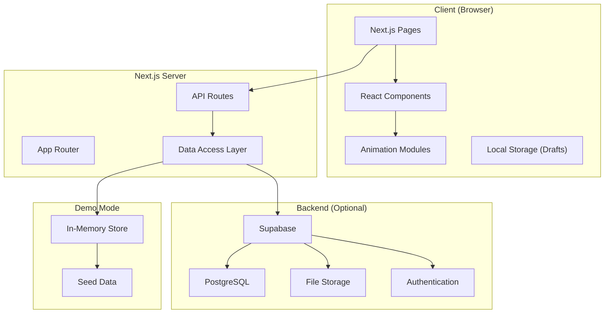
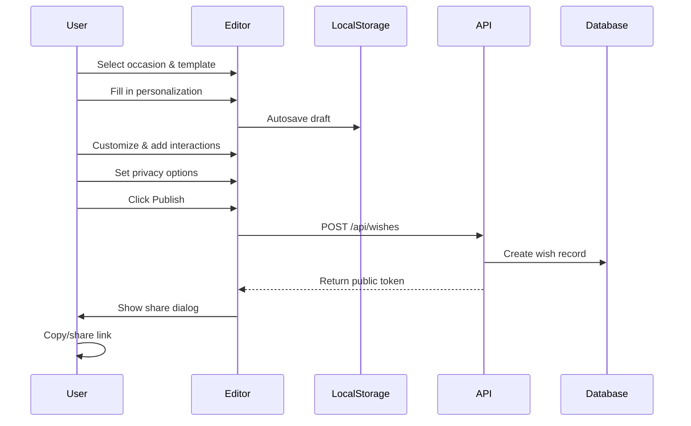
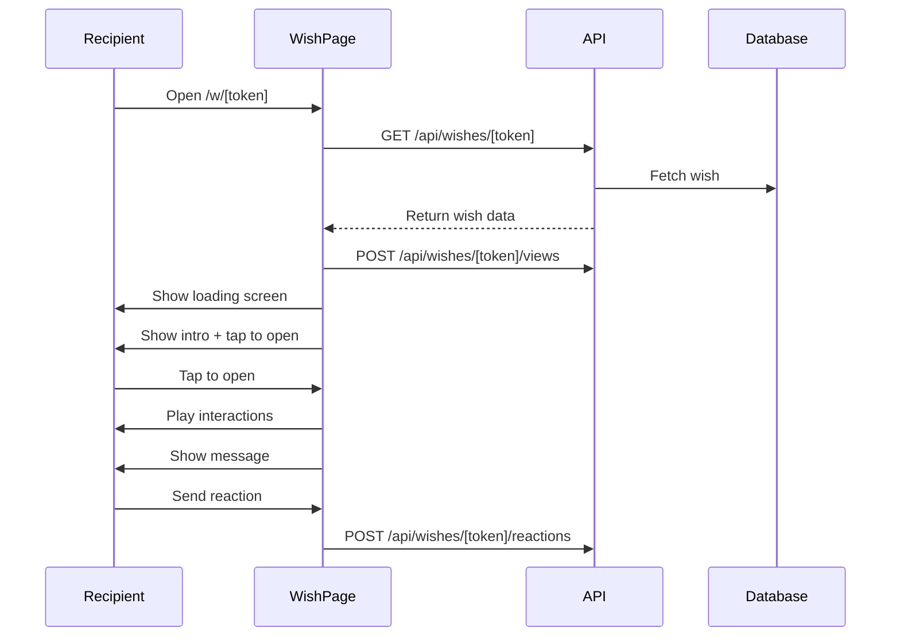

# Wishora Architecture

## Overview

Wishora is a Next.js application using the App Router pattern. It's designed to work in two modes:
1. **Demo Mode** — In-memory data store, no external dependencies
2. **Production Mode** — Supabase for database, auth, and storage

## System Architecture



## Route Map

| Route | Type | Description |
|-------|------|-------------|
| `/` | Marketing | Homepage with hero, templates, FAQ |
| `/templates` | Marketing | Searchable template gallery |
| `/occasions/[slug]` | Marketing | SEO landing pages per occasion |
| `/create` | Creation | Occasion & template selection |
| `/create/[templateSlug]` | Creation | Multi-step wish editor |
| `/w/[token]` | Recipient | Public wish experience |
| `/dashboard` | Auth | User dashboard |
| `/dashboard/wishes` | Auth | Wish management |
| `/dashboard/settings` | Auth | User settings |
| `/explore` | Community | Public wishes gallery |
| `/login` | Auth | Login page |
| `/signup` | Auth | Registration page |
| `/pricing` | Marketing | Pricing information |
| `/about` | Marketing | About page |
| `/contact` | Marketing | Contact form |
| `/help` | Marketing | Help center |
| `/privacy` | Legal | Privacy policy |
| `/terms` | Legal | Terms of service |

## Data Flow

### Wish Creation Flow



### Wish Viewing Flow



## Component Architecture

```
Components
├── ui/                    # Base design system
│   ├── Button
│   ├── Card
│   ├── Input, Textarea, Select
│   ├── Dialog
│   ├── Tabs
│   ├── Accordion
│   ├── Badge
│   ├── Skeleton
│   ├── ProgressBar
│   ├── EmptyState
│   ├── Avatar
│   └── Toast
├── marketing/             # Layout components
│   ├── Navbar
│   └── Footer
└── interactions/          # Animation modules
    ├── ConfettiLayer
    ├── BalloonPop
    ├── CandleInteraction
    ├── GiftBoxReveal
    ├── EnvelopeReveal
    ├── BloomingRoses
    ├── CountdownTimer
    ├── QuizInteraction
    ├── PollInteraction
    ├── ScratchReveal
    ├── MemoryGallery
    ├── SparkleBackground
    └── HeartAnimation
```

## Data Access Abstraction

The `DataAdapter` interface abstracts all database operations:

```typescript
interface DataAdapter {
  createWish(wish: Partial<Wish>): Promise<Wish>;
  getWishByToken(publicToken: string): Promise<Wish | null>;
  updateWish(id: string, data: Partial<Wish>): Promise<Wish>;
  deleteWish(id: string): Promise<void>;
  publishWish(id: string): Promise<Wish>;
  addReaction(wishId: string, reactionType: ReactionType): Promise<WishReaction>;
  addReply(wishId: string, displayName: string, body: string): Promise<WishReply>;
  addView(wishId: string, deviceType?: string): Promise<void>;
  // ... more methods
}
```

Two implementations:
1. `DemoDataAdapter` — In-memory store with seed data
2. `SupabaseAdapter` — Real Supabase integration (when configured)

## Design Decisions

1. **Demo Mode First** — App works without any backend, making development and demos easy
2. **Template as Configuration** — Templates are data, not code, making them easy to add and modify
3. **Client-Side Draft Storage** — Drafts save to localStorage for offline resilience
4. **Progressive Enhancement** — Core content works without JavaScript animations
5. **Mobile-First** — All layouts designed for 360px screens first
6. **Reduced Motion** — All animations respect `prefers-reduced-motion`
7. **No Sequential IDs** — Public URLs use cryptographic tokens, not database IDs
