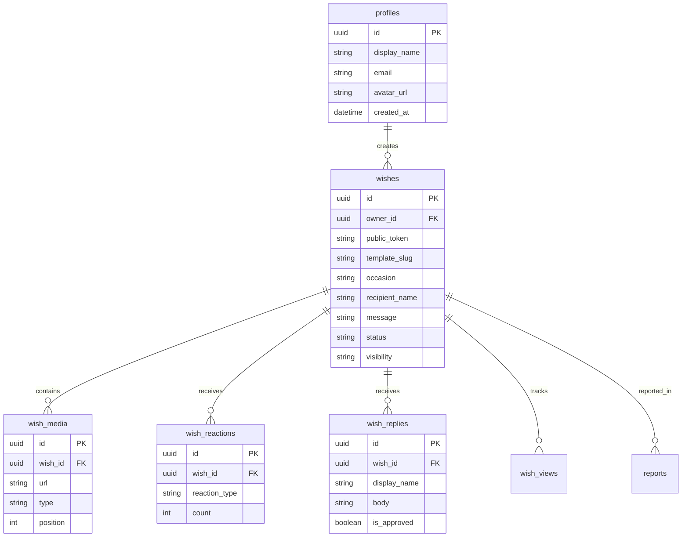

# Wishora Database Architecture

## Schema Overview

The database uses PostgreSQL (hosted on Supabase) with the following core entities:

### `profiles`
Stores user information for authenticated creators.

### `wishes`
The core entity representing a created wish.
- Identified publicly via `public_token`
- Can be owned by a registered user (`owner_id`) or created anonymously (managed via `creator_manage_token_hash`)
- Tracks lifecycle via `status` ('draft', 'published', 'archived', 'expired')

### `wish_media`
Stores references to external media (images, audio, video) attached to a wish.

### `wish_reactions`
Aggregates reactions (e.g. ❤️, 👍) left by visitors on a specific wish.

### `wish_replies`
Comments left by the recipient or visitors on a wish.

### `wish_views`
Analytics tracking for views of a specific wish.

### `reports`
Moderation queue for user-reported content.

## Entity Relationship Diagram



## Key Design Decisions

1. **Public Tokens**: Used instead of UUIDs in URLs for better user experience and to prevent enumeration.
2. **Flexible Ownership**: Users can create wishes without an account using a session-based hash (`creator_manage_token_hash`). They can claim them later by linking to `owner_id`.
3. **JSONB Settings**: The `settings` column in `wishes` allows for template-specific configuration without schema changes.
4. **Soft Limits & Expiration**: Wishes have optional `scheduled_for` and `expires_at` timestamps for automated lifecycle management.

## Migrations

Migrations are stored in `supabase/migrations/`.
To apply migrations locally:
```bash
supabase db push
```
